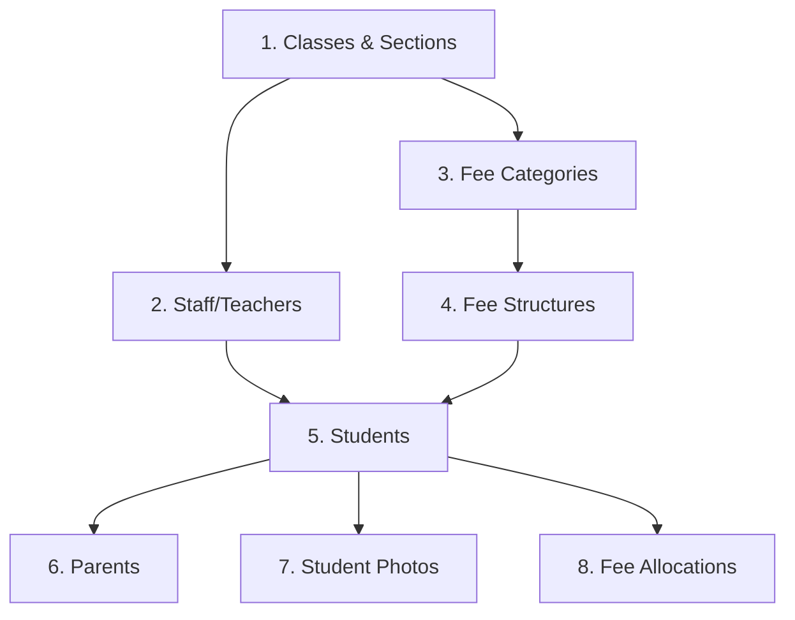

# ERP Migration Guide - NucleIQ

Complete guide for migrating your school/institution data from existing ERP systems to NucleIQ.

---

## Table of Contents
1. [Pre-Migration Checklist](#pre-migration-checklist)
2. [Data Export Templates](#data-export-templates)
3. [Import Sequence](#import-sequence)
4. [Step-by-Step Instructions](#step-by-step-instructions)
5. [Validation & Verification](#validation--verification)
6. [Common Issues & Solutions](#common-issues--solutions)
7. [Rollback Procedures](#rollback-procedures)

---

## Pre-Migration Checklist

### Before You Begin

- [ ] **Admin Access**: Ensure you have tenant admin access to NucleIQ
- [ ] **Current ERP Backup**: Create a full backup of your existing ERP data
- [ ] **Academic Year Setup**: Create the current academic year in NucleIQ (Settings → Academic Setup)
- [ ] **Classes & Sections**: Set up all classes and sections first (Settings → Academic Setup)
- [ ] **Fee Categories**: Create fee categories if importing fee data (Fees → Configure)
- [ ] **Estimated Time**: Plan for 2-4 hours depending on data volume

### Required Information
| Data Type | Minimum Fields Required |
|-----------|------------------------|
| Students | Admission No, First Name, Last Name, DOB, Gender, Father Name, Mother Name, Father Phone, Mother Phone |
| Staff | Employee ID, First Name, Last Name, Email, Date of Joining |
| Classes | Class Name, Section Name |
| Fee Structures | Fee Type, Class, Amount, Frequency |

---

## Data Export Templates

### Downloading Templates

1. Login to NucleIQ as Tenant Admin
2. Navigate to **Settings → Data Management**
3. Select the module you want to import
4. Click **"Download Template"**

### Available Templates

| Template | File | Primary Key | Notes |
|----------|------|-------------|-------|
| Students | students_template.xlsx | admission_number | Includes parent info |
| Staff | staff_template.xlsx | employee_id | All employee types |
| Classes & Sections | classes_template.xlsx | class_name + section_name | Must import before students |
| Fee Structures | fee_structures_template.xlsx | - | Requires classes to exist |
| Parents | parents_template.xlsx | admission_number | Links to existing students |
| Student Photos | ZIP file | admission_number.jpg | Name files by admission no. |

### Template Structure

Each template contains:
- **Main Sheet**: Data columns with sample row
- **Instructions Sheet**: Field descriptions and format requirements

### Date Formats
All date fields accept:
- `dd-mm-yyyy` (e.g., 15-05-2010)
- `dd/mm/yyyy` (e.g., 15/05/2010)
- `yyyy-mm-dd` (ISO format)

---

## Import Sequence

> **IMPORTANT**: Follow this exact order to avoid dependency errors.



### Recommended Order

1. **Classes & Sections** - Required for student enrollment
2. **Staff** - Teachers need to exist for class assignments
3. **Fee Categories** - Required for fee structures
4. **Fee Structures** - Requires classes and fee categories
5. **Students** - Core data, requires classes to exist
6. **Parents** - Links to students by admission number
7. **Student Photos** - Upload as ZIP after students exist
8. **Fee Allocations** - Individual student fee assignments

---

## Step-by-Step Instructions

### Step 1: Export Data from Existing ERP

#### Generic Database Export
```sql
-- Students export example
SELECT 
    admission_number, first_name, last_name, 
    date_of_birth, gender, email, phone,
    father_name, mother_name, father_phone, mother_phone,
    class_name, section_name
FROM students
WHERE status = 'Active';
```

#### Common ERP Exports

| ERP System | Export Method |
|------------|---------------|
| Fedena | Reports → Student Details → Export to Excel |
| OpenSIS | Students → Reports → Export Data |
| SARAL | Administration → Data Export |
| Custom | Contact your IT team for database export |

### Step 2: Map Data to NucleIQ Format

1. Open the downloaded NucleIQ template
2. Open your exported data
3. Copy data column by column, matching headers
4. Ensure date formats are correct (dd-mm-yyyy or dd/mm/yyyy)
5. Remove any empty rows

#### Field Mapping Examples

| Your ERP Field | NucleIQ Field |
|---------------|---------------|
| student_id / roll_no | admission_number |
| fname / firstname | first_name |
| lname / lastname | last_name |
| dob / birth_date | date_of_birth |
| sex / gender | gender (M/F/Other) |
| class / grade | class_name |

### Step 3: Validate Before Import

Check for:
- [ ] No duplicate admission numbers
- [ ] All required fields have values
- [ ] Dates are in correct format
- [ ] Class names match exactly with NucleIQ setup
- [ ] Phone numbers are 10 digits (Indian format)

### Step 4: Import Data

1. Go to **Settings → Data Management**
2. Select the module (e.g., Students)
3. Click **"Import Data"**
4. Upload your prepared file
5. Review the validation results
6. Handle duplicates if detected
7. Confirm import

### Step 5: Verify Import

After each import:
1. Check total count matches expected
2. Open a few random records to verify data
3. Check the **Audit Logs** for import activity
4. Test any linked features (e.g., fee collection for students)

---

## Validation & Verification

### Post-Import Checklist

| Check | How to Verify |
|-------|---------------|
| Student Count | Students → Count matches your records |
| Class Enrollment | Check students appear in correct classes |
| Parent Linking | Parent phone numbers show linked students |
| Fee Structures | Fee collection shows correct amounts |
| Staff Directory | Staff list shows all imported employees |

### Data Integrity Checks

```
Total Expected Students: ___
Total Imported: ___
Duplicates Skipped: ___
Failed Records: ___
```

---

## Common Issues & Solutions

### Issue: "Class not found" Error
**Solution**: Ensure the class name in your import file exactly matches the class name in NucleIQ (case-sensitive).

### Issue: "Duplicate admission number"
**Solution**: 
- Check if student already exists in NucleIQ
- Use "Override Duplicates" option to update existing records
- Or modify admission number in import file

### Issue: Date Parsing Error
**Solution**: Ensure all dates use `dd-mm-yyyy` or `dd/mm/yyyy` format.

### Issue: Phone Number Invalid
**Solution**: Phone numbers should be 10 digits without country code or spaces.

### Issue: Import Times Out
**Solution**: Split large files into batches of 500-1000 records.

---

## Rollback Procedures

### If Import Goes Wrong

1. **Use Recycle Bin**: 
   - Navigate to **Admin → Recycle Bin**
   - Filter by date and entity type
   - Select incorrectly imported records
   - Bulk delete if needed

2. **Re-import with Corrections**:
   - Fix errors in your import file
   - Use the updated file to re-import

3. **Contact Support**:
   - For critical issues, contact NucleIQ support
   - Provide audit log exports for debugging

---

## Support

For migration assistance:
- **Email**: support@nucleiq.io
- **Documentation**: https://docs.nucleiq.io
- **In-App Help**: Click the help icon in any module

---

*Last Updated: January 2026*
